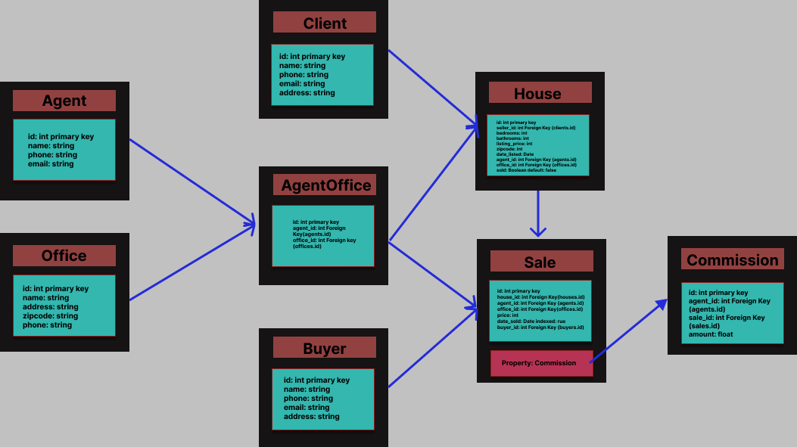

# Real Estate Head Office Database

## Overview

This directory contains a database design and implementation for a real estate head office. The database is designed to store information about the various office branches, its employees, and the properties that it manages. It also keeps track of all the clients and buyers that the company has dealt with along with doing all the calculations for you. The database is implemented using SQLalchemy and instructions on its use are provided below.

## Installation and Use

Once you have python and the folder installed on your computer, please navigate to the directory in your terminal. Then run the following commands in order if you are on Windows:

```bash
python -m venv venv
venv\Scripts\activate.bat
pip install -r requirements.txt
```

On a mac, run the following commands instead:

```bash
python3 -m venv venv
source venv/bin/activate
pip3 install -r requirements.txt
```

Once you have done this, you can run the database by running the following command:

```bash
python create.py
python insert_data.py
python query_data.py
```

These commands will create the database, insert the data into the database, and then run the queries that are provided in the assignment. The results will be printed out in the terminal. By default, the queries are run for the current month but if you want to change that, you can do so by changing the `current_month` variable in the `query_data.py` file. Just replace the number with the month of the year you want to run the query for and you can do the same for the current_year variable.

## Testing

To run the tests, run the following command:

```bash
python test.py
```

This command should run the tests and print out the results in the terminal. For further information on the tests, please refer to the `test.py` file. The current tests test for all of the implementation in the 'create.py' file making sure that the data is stored as intended in the database. Similarly, it uses functionality implemented in the 'insert_data.py' file to make sure that process works as well. Moreover, it also tests that the commission calculation is done correctly based on the rules specified in the assignment by comparing the results to the expected results from manual calculations. Finally, it uses a 'test.db' file rather than the main database and then destroys the database after the tests are run. This makes sure that the tests do not affect the main database and its integrity is maintained while also making sure that we don't take up too much space on the system by leaving the database after the tests are run.

## Database Design

### Data normalization

Data normalization is when data is organized in a way to reduce redundancy and improve data integrity. In the create.py file, the database is designed so that columns are only linked by Foreign keys when needed and these Foreign keys are Primary keys from another table in the database. This is done to ensure that the data is not redundant and that the data is consistent. For example,  the 'houses' table has columns called 'agent_id' and 'office_id'. These columns ensure that each house is allocated to an agent and the agent's corresponding office. This is done using the AgentOffice table which has a Foreign key to the 'agents' table and a Foreign key to the 'offices' table. This ensures that the data is consistent and that the data is not redundant. This way, we can store information about the agent and the office in the House table without having to use names or other identifiers that could be inconsistent or have errors. Similarly, it is also ensured that when a house is sold, the house's status column is set to True indicating that it has been sold while False indicates that it is still on the market.

## Indices

Indices are used to optimize query performance by quickly allowing the database to locate the data that is being queried. However, indices also take up space in the database and so they should only be used when they are needed. Since most of our queries use the 'date_sold' column in the 'Sales' table, that column has been indexed in order to make the queries faster. When I was running the queries without indexing, the database was taking much longer with some queries.

## Database Schema


